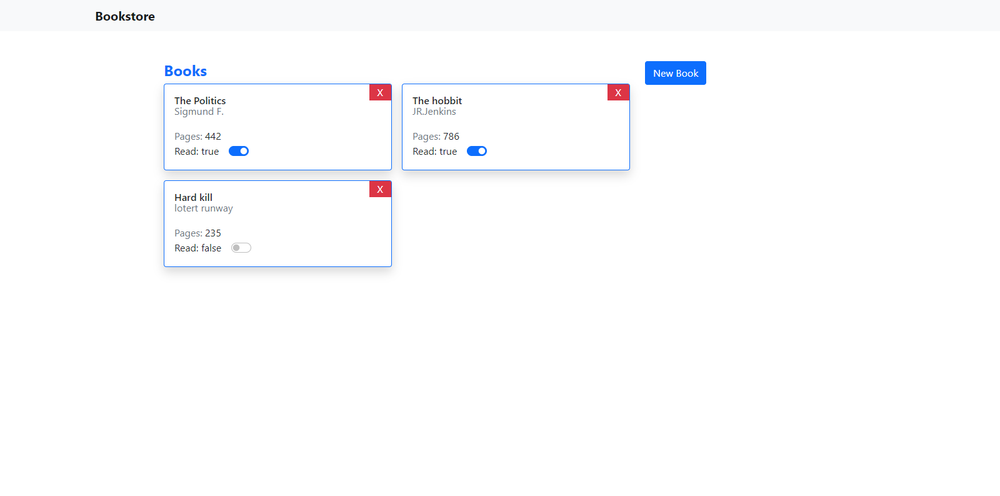

# Bookstore

# Book-Store

This project is a demo website for a libray, developed using Javascript. 

## `Build-With:`
- Hmtl/css
- javascript
- VScode

## `Live Demo:`

[Book-Store](https://rawcdn.githack.com/AkintoyeOlamide/Bookstore/1600ea41074768810e1f936ded679ae44e5c5a99/index.html)

## `Screen-shots:`

# Getting Started:

### `Prerequisites`

To get this project up and running locally, "npm install" is needed to be run in order to include all dependencies used for this project.

**To get this project set up on your local machine, follow these simple steps:**

1. Open Terminal.
2. Navigate to your desired location to download the contents of this repository.
3. Copy and paste the following code into the Terminal: git clone `https://github.com/AkintoyeOlamide/Bookstore`.
4. Into the Terminal: run `cd Bookstore`.
7. To see the website in the browser, open the index.html page and right click then clive on live server.

## `Author Details::`

👤 **Silas kalu**

- Github: [@cyonii](https://github.com/cyonii)

👤 **Akintoye Oluwatobiloba**

- Github: [@Akintoyeolamide](https://github.com/AkintoyeOlamide)

## `Show your support:`

Give ⭐ Star me on GitHub — it helps!

## 📝 `License`

This project is [MIT](lic.url) licensed.
